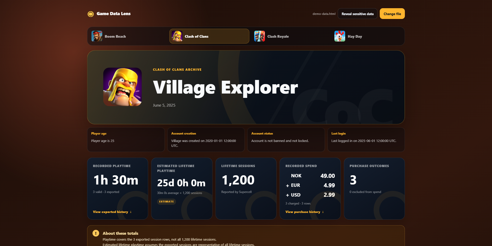
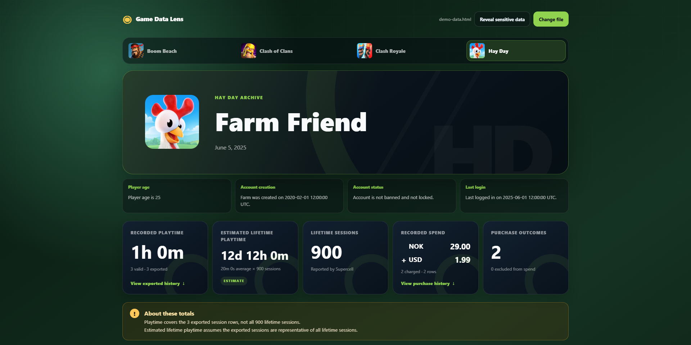

# Game Data Lens

A visual representation of your Supercell data.

**[Open Game Data Lens →](https://confusedjonas.github.io/game-data-lens/)**

Choose your Supercell HTML export to view playtime, purchases, and account statistics. No installation or account needed. **Your file stays in your browser and is never uploaded**, including when using the hosted website. Refreshing clears it.

## Get your data

Request your personal data through Supercell's official support pages:

[Clash of Clans](https://support.supercell.com/clash-of-clans/en/articles/gdpr.html) · [Clash Royale](https://support.supercell.com/clash-royale/en/articles/gdpr.html) · [Boom Beach](https://support.supercell.com/boom-beach/en/articles/gdpr.html) · [Hay Day](https://support.supercell.com/hay-day/en/articles/gdpr.html) · [Brawl Stars](https://support.supercell.com/brawl-stars/en/articles/gdpr.html)

You can also use **Settings → Help and Support** in-game. Follow Supercell's verification steps; the report is sent to your Supercell ID email. Download links expire after two weeks.

Select the `.html` or `.htm` summary, usually named `Summary of Your Data - Supercell.htm` (up to 25 MB). If downloaded as a ZIP, extract it first. This viewer never needs your Supercell password or verification code.

## Games and totals

Recognizes Clash of Clans, Clash Royale, Boom Beach, Hay Day, Brawl Stars, and mo.co when present in the export. Other games use a generic view. Files with one, several, or all games work; use the game icons to switch.

- **Recorded playtime:** total duration of valid exported sessions.
- **Estimated lifetime playtime:** average valid session duration × reported lifetime session count. This is an estimate, not a measured total.
- **Recorded spend:** charged purchases, kept separate by currency. Refunds are shown separately; refunded, cancelled, and not-charged purchases are excluded.

Exports may contain only part of your history. Expand the session and purchase panels to see every included row. Missing data is not invented, and source timestamps are preserved.

IP addresses and connected-account identifiers are masked until you choose to reveal them. Game icons load separately from the official fan kit, without access to your export. [Privacy & artwork details](https://confusedjonas.github.io/game-data-lens/privacy.html).

## Download instead?

**[Download ZIP](https://github.com/ConfusedJonas/game-data-lens/archive/refs/heads/main.zip)** → extract → open `game-data-lens-main/dist/index.html` in your browser.

Keep the `dist` files together. No installation or local server needed. Data viewing works offline; icons fall back to letter badges when unavailable.

## Examples

Screenshots use fictional demo data.

## Disclaimer and license

Game Data Lens is unofficial and is not endorsed by Supercell. See [Supercell's Fan Content Policy](https://supercell.com/en/fan-content-policy/).

The [MIT license](LICENSE) covers the code, not Supercell's names or artwork. Icons use conditional fan-content permission. [Artwork sources](ASSET_SOURCES.md) · [Third-party notices](THIRD_PARTY_NOTICES.md).
